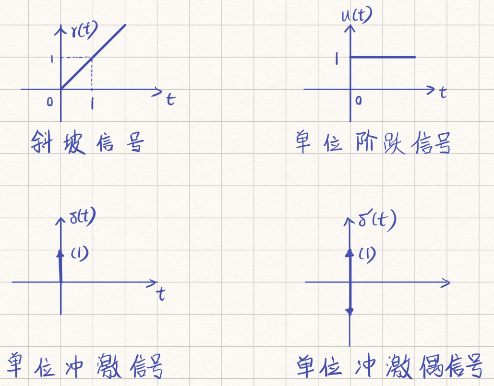
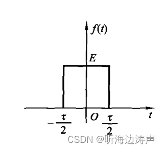

# 第一章 连续信号的分析

## 第一节连续信号的时域描述和分析

### 一、连续信号的时域描述

#### (一)普通信号的时域描述

##### 1.正弦信号
$ x(t)=A\sin(\omega_0 t+\phi_0)=A\cos(\omega_0 t+\phi_0-\frac{\pi}{2})    -\infty<t<\infty$

##### 2.指数信号
$x(t)=Ae^{st}  -\infty<t<\infty$

#### (二)奇异信号的描述

##### 1.单位斜坡信号
$$
r(t)=\begin{cases}
t,t\geq 0\\
0,t<0
\end{cases}
$$

##### 2.单位斜坡信号
$$
u(t)=\begin{cases}
1,t>0\\
0,t<0
\end{cases}
$$

由单位斜坡信号可以得到矩形信号$x(t)=A[u(t+\frac{\tau}{2})-u(t-\frac{\tau}{2})]\\$

##### 3.单位冲激信号
$$
\begin{cases}
\delta(t),t\neq0\\
\int_{-\infty}^{\infty}\delta(t)dt=1,t=0
\end{cases}
$$

冲激信号的性质

$1.若\delta(t)在x=0处连续,则有\int_{-\infty}^{\infty}x(t)\delta(t)dt=x(0)$

2.冲激信号具有偶函数特性

3.冲激信号于阶跃信号互为积分和微分得到关系

$\int_{-\infty}^t\delta(\tau)d\tau=u(t)$

$\frac{du(t)}{dt}=\delta(t)$

### 二、连续信号的时域分析
#### (一)基本运算
##### 1.尺度变换
##### 2.翻转
##### 3.平移
#### (二)叠加和相乘
#### (三)微分和积分
#### (三)卷积运算
$x_1(t)*x_2(t)=\int_{-\infty}^{\infty}x_1(\tau)x_2(t-\tau)d\tau=\int_{-\infty}^{\infty}x_1(t-\tau)x_2(\tau)d\tau$

### 三、连续信号的时域分析
#### (一)分解成冲激函数之和
#### (二)正交分解
##### 1.正交函数集
$在(t_1,t_2)区间内定义的两个非零实函数f_1(t)与f_2(t),若满足$
$\int_{-\infty}^{\infty}f_1(t)f_2(t)dt=0$
则称$f_1(t)与f_2(t)在区间(t_1,t_2)内正交$

任意两个正交函数构成的集合是正交函数集若除正交函数集外不存在非零函数$\phi(t)满足$

$\int_{t1}^{t2}\phi(t)f_i(t)dt=0 ,i=1,2……n $
则称此函数正交集为完备正交函数集

##### 2.信号的正交分解

## 第二节 连续信号的频域分析
### 一、周期信号的频谱分析
#### (一)周期信号的的傅里叶级数展开式
一个周期为$T_0=\frac{2\pi}{\omega_0}$的周期信号，只要满足狄里赫利条件都可以分解成三角函数表达式
$x(t)=\frac{a_0}{2}+\sum_{n=1}^{\infty}(a_n\cos(n\omega_0t+\phi_n)+b_n\sin(n\omega_0t+\phi_n))$

傅里叶级数的指数形式
$x(t)=\frac{1}{2}\sum_{n=-\infty}^{\infty}A_ne^{j\phi_0}e^{jn\omega_0t}=\sum_{n=-\infty}^{\infty}X(n\omega_0)e^{jn\omega_0t}$

#### (二)周期信号的频谱
$X(n\omega_0)也称为周期信号的频谱函数$

模$|X(n\omega_0)|=\frac{1}{2}A_n$

#### (三)周期信号的功率分配
#### (四)周期信号的傅里叶级数近似

### 二、非周期信号的频谱分析

#### (一)从傅里叶级数到傅里叶变换
$$
1.X(\omega)=\int_{-\infty}^{\infty}x(t)e^{-j\omega t}dt\\
2.x(t)=\frac{1}{2\pi}\int_{-\infty}^{\infty}X(\omega)e^{j\omega t}d\omega
$$
$其中1式称为傅里叶变换,它将连续时间函数x(t)变换为频率的连续函数X(\omega)$
因此,$X(\omega)称为x(t)的傅里叶变换$

2式也可以写成

$x(t)=\frac{1}{2\pi}\int_{-\infty}^{\infty}|X(\omega)|\cos[\omega t+\phi(\omega)]d\omega+\frac{j}{2\pi}\int_{-\infty}^{\infty}|X(\omega)|\sin[\omega t+\phi(\omega)]d\omega$
